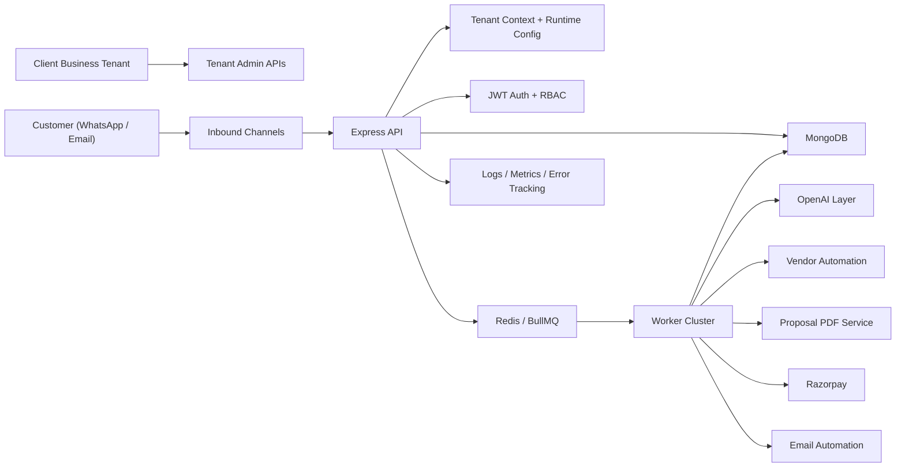

# AI Concierge SaaS Platform

## 1. SaaS Architecture Design



- The platform is now organized as a shared-control-plane, shared-runtime multi-tenant SaaS.
- Tenant isolation is enforced through request middleware, worker tenant restoration, and tenant-scoped persistence.
- Tenant runtime config controls channel credentials, AI behavior, pricing rules, proposal branding, automation limits, and feature flags.

## 2. Multi-Tenant Data Model

- `Tenant`
  - Owns slug, lifecycle status, primary contact, feature flags, and runtime configuration.
- `AdminUser`
  - Linked to `tenantId`, supports `super_admin`, `tenant_admin`, and `ops_admin`.
- Tenant-scoped operational collections
  - `Customer`, `Conversation`, `Enquiry`, `Vendor`, `VendorRequest`, `Quote`, `Proposal`, `Payment`, `Booking`, `Notification`, `AuditLog`, `WebhookReceipt`, `IdempotencyKey`, `EmailMessage`, `UsageEvent`.
- Key isolation rules
  - Compound uniqueness is tenant-aware, for example `tenantId + email`, `tenantId + idempotencyKey`, `tenantId + provider + externalEventId`.

## 3. Config System Design

- Runtime config lives in `Tenant.config`.
- Current supported config groups:
  - `ai`: tone, style guide, fallback reply, clarification strategy, hallucination guardrails
  - `proposal`: company name, accent color, template name, footer note
  - `automation`: vendor retry limit, customer follow-up minutes, payment retry limit
  - `pricing`: service fee percentage, minimum service fee, currency
  - `integrations.whatsapp`: verify token, app secret, phone number id, access token, API version
  - `integrations.razorpay`: key id, key secret, webhook secret
  - `integrations.email`: from address, inbound webhook secret, IMAP settings
  - `integrations.vendorAutomation`: inbound webhook secret
- `resolveCurrentTenantConfig()` provides tenant config with safe defaults for bootstrap and local development.

## 4. New Modules To Add

- `src/modules/tenants`
  - Tenant CRUD, config persistence, runtime resolution
- `src/modules/dashboard`
  - Overview, funnel, volume, recent activity APIs for tenant admins
- `src/modules/emails`
  - Inbound email ingestion, email-to-enquiry conversion, automated replies, message history
- `src/modules/usage`
  - Tenant usage event tracking for future SaaS billing and reporting
- `src/infrastructure/tenancy`
  - Async tenant context, tenant-scoped model plugin, create-payload helpers
- `src/infrastructure/resilience`
  - Circuit breaker primitives and timeout handling for external integrations

## 5. Updated Folder Structure

```text
src/
  common/
  config/
  infrastructure/
    cache/
    db/
    http/
    logging/
    observability/
    queue/
    resilience/
    tenancy/
  middleware/
  modules/
    auth/
    audit/
    bookings/
    conversations/
    dashboard/
    emails/
    enquiries/
    health/
    integrations/
    notifications/
    payments/
    proposals/
    quotes/
    tenants/
    usage/
    users/
    vendors/
  workers/
```

## 6. API Additions

- Tenant administration
  - `GET /api/tenants/current`
  - `GET /api/tenants`
  - `POST /api/tenants`
  - `PATCH /api/tenants/:tenantId`
- Tenant dashboards
  - `GET /api/dashboard/overview`
  - `GET /api/dashboard/funnel`
  - `GET /api/dashboard/activity`
- Email automation
  - `GET /api/emails`
  - `POST /api/webhooks/:tenantSlug/emails`
  - `POST /api/webhooks/emails`
- Public shared proposal access
  - `GET /api/proposals/shared/:proposalId/document?token=...`
- Tenant-aware webhooks
  - `POST /api/webhooks/:tenantSlug/whatsapp`
  - `POST /api/webhooks/:tenantSlug/vendor-responses`
  - `POST /api/payments/webhook/:tenantSlug`

## 7. Code Improvements (with examples)

- Tenant-safe repository creation

```ts
const document = await ProposalModel.create(
  attachTenantPayload(payload as Record<string, unknown>)
);
```

- Explicit tenant propagation in long-running flows

```ts
const tenantId = getTenantIdFromEntity(enquiry)
  || getTenantIdFromEntity(customer)
  || getCurrentTenantId();
```

- Queue jobs carry tenant ownership so workers can restore scope safely

```ts
await proposalGenerationQueue.add("proposal-generation", {
  tenantId,
  enquiryId: quote.enquiryId.toString()
});
```

- Webhook dedupe is tenant-aware and no longer depends only on a unique-index race

```ts
const existing = await WebhookReceiptModel
  .findOne(this.buildScopedFilter(provider, externalEventId))
  .lean();
```

## 8. Deployment Plan

- Build once per environment with `Dockerfile` and run separate API and worker deployments.
- Use shared MongoDB and Redis clusters.
- Apply environment config for platform-level defaults only; tenant credentials live in MongoDB.
- CI pipeline should run:
  - `npm run lint`
  - `npm run build`
  - `npm run test:smoke`
  - `npm run test:hardening`
- Recommended runtime split:
  - `api`
  - `worker`
  - optional `scheduler` if queue orchestration grows further

## 9. Scaling Plan

- Horizontal API scaling behind a load balancer is now safe because state is in MongoDB/Redis.
- Workers scale independently by queue pressure.
- Suggested queue partitioning at higher load:
  - conversational
  - vendor operations
  - proposal generation
  - payments and booking lifecycle
  - notifications
- Index priorities:
  - tenant-scoped compound indexes on all high-volume collections
  - read-heavy dashboards should aggregate on indexed `tenantId + createdAt`
- Usage tracking enables per-tenant throttling and future monetization.

## 10. How To Onboard A New Client In 10 Minutes

1. Create a tenant through `POST /api/tenants` with slug, name, feature flags, and config.
2. Add tenant admin credentials mapped to that `tenantId`.
3. Paste WhatsApp, Razorpay, email, and vendor webhook secrets into the tenant config.
4. Configure proposal branding, AI tone, and pricing rules.
5. Seed or import vendor records for that tenant.
6. Point client-facing webhooks to:
   - `/api/webhooks/:tenantSlug/whatsapp`
   - `/api/webhooks/:tenantSlug/emails`
   - `/api/payments/webhook/:tenantSlug`
7. Validate with the smoke flow in staging.
8. Hand over the tenant admin login and dashboard endpoints.
