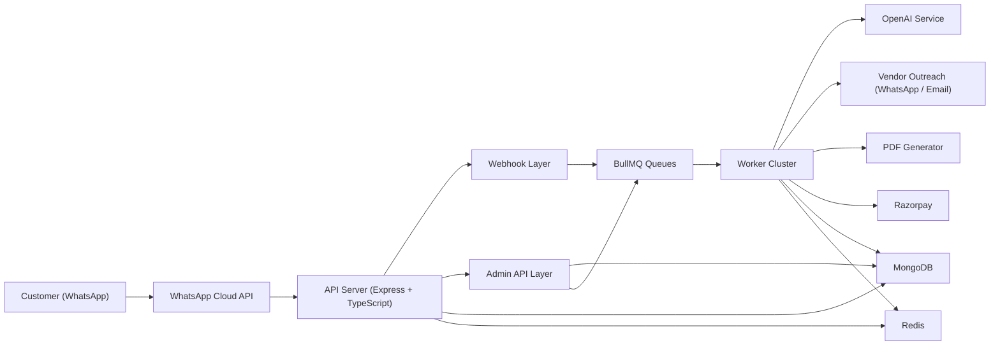

# AI Concierge System Design

## 1. High-Level Architecture Diagram



### Explanation

- `API Server` handles public webhooks, admin APIs, authentication, validation, rate limiting, and idempotency.
- `BullMQ` decouples inbound chat processing, vendor outreach, quote normalization, proposal generation, reminders, and booking updates.
- `MongoDB` persists every operational entity so the system can recover state after failures.
- `Workers` perform long-running or failure-prone tasks away from the request path.
- `OpenAI` is wrapped behind a structured prompt layer to keep outputs machine-parseable.
- `Redis` powers queues and delayed retries.
- `Razorpay` is event-driven via verified webhook callbacks.

## 2. Folder Structure

```text
.
├── .github/workflows/ci.yml
├── Dockerfile
├── docker-compose.yml
├── package.json
├── src
│   ├── app.ts
│   ├── server.ts
│   ├── worker.ts
│   ├── container.ts
│   ├── routes.ts
│   ├── common
│   │   ├── errors
│   │   ├── types
│   │   └── utils
│   ├── config
│   ├── infrastructure
│   │   ├── cache
│   │   ├── db
│   │   ├── http
│   │   ├── logging
│   │   └── queue
│   ├── middleware
│   ├── modules
│   │   ├── auth
│   │   ├── audit
│   │   ├── bookings
│   │   ├── conversations
│   │   ├── enquiries
│   │   ├── health
│   │   ├── integrations
│   │   ├── notifications
│   │   ├── payments
│   │   ├── proposals
│   │   ├── quotes
│   │   ├── users
│   │   └── vendors
│   └── workers
└── docs/system-design.md
```

### Structural Rationale

- `modules/*` use controller-service-repository separation.
- `integrations/*` isolates external providers from business logic.
- `workers/*` centralizes background job execution.
- `container.ts` wires dependencies without leaking construction into route handlers.

## 3. Database Schema

### Collections

- `AdminUser`
  - Admin credentials, role, active flag, login tracking.
- `Customer`
  - WhatsApp identity, preferences, memory summary, historical memory events.
- `Conversation`
  - Channel session, conversation state, full message history, clarifications, context snapshot.
- `Enquiry`
  - Structured concierge request with lifecycle status, requirements, vendor matches, quote/proposal/booking references.
- `Vendor`
  - Capabilities, coverage, rating, contact points, service support.
- `VendorRequest`
  - Per-enquiry vendor outreach record with status, retries, due time, last response.
- `Quote`
  - Raw vendor quote plus AI-normalized commercial structure and ranking score.
- `Proposal`
  - Recommended quote, PDF path, premium WhatsApp message, versioning.
- `Payment`
  - Razorpay order/payment mapping, status, receipts, webhook event log.
- `Booking`
  - Confirmed service record tied to quote, proposal, payment, and vendor.
- `Notification`
  - Reliable outbound delivery records with idempotency, retry state, and timestamps.
- `AuditLog`
  - Immutable operational audit trail for critical actions.
- `WebhookReceipt`
  - Replay protection for inbound provider events.
- `IdempotencyKey`
  - Safe replay of mutating admin APIs.

### Indexing Strategy

- Customer by `phone`
- Enquiry by `customerId + createdAt`, `status`, `serviceType`
- Vendor by `supportedServices + geoCoverage + isActive`
- VendorRequest by `enquiryId + vendorId` unique
- Payment by `razorpayOrderId`, `receipt`
- WebhookReceipt by `provider + externalEventId` unique
- IdempotencyKey with TTL index on `expiresAt`

## 4. API Design

### Public Endpoints

- `GET /api/health`
- `GET /api/webhooks/whatsapp`
- `POST /api/webhooks/whatsapp`
- `POST /api/webhooks/vendor-responses`
- `POST /api/payments/webhook`
- `GET /storage/*`

### Admin Endpoints

- `POST /api/auth/login`
- `GET /api/enquiries`
- `GET /api/enquiries/:enquiryId`
- `GET /api/vendors`
- `POST /api/vendors`
- `PATCH /api/vendors/:vendorId`
- `GET /api/quotes?enquiryId=...`
- `POST /api/quotes`
- `POST /api/proposals/generate`
- `GET /api/proposals/:proposalId`
- `POST /api/payments/orders`
- `GET /api/bookings`
- `PATCH /api/bookings/:bookingId`
- `GET /api/conversations`
- `GET /api/audit-logs`

### Controller Pattern

- Controllers are thin and transport-focused.
- Services own orchestration and state transitions.
- Repositories own database interactions only.

## 5. WhatsApp Webhook Implementation

### Receive Flow

1. Meta calls `POST /api/webhooks/whatsapp`.
2. `WhatsAppService.verifySignature()` validates `x-hub-signature-256`.
3. `WebhookReceiptRepository` blocks replayed message IDs.
4. Valid text messages are enqueued into `conversation-processing`.
5. API acknowledges immediately with `200`.

### Verify Flow

1. Meta calls `GET /api/webhooks/whatsapp`.
2. Verify token is compared with `WHATSAPP_VERIFY_TOKEN`.
3. Challenge string is echoed back on success.

## 6. AI Conversation Flow

### Prompt Design

The conversation model is instructed to:

- speak in a polished luxury concierge tone
- return JSON only
- extract structured requirements
- decide whether to clarify or proceed
- preserve customer memory and active enquiry context

### Conversation Logic

1. Upsert customer from WhatsApp sender.
2. Load active conversation and latest active enquiry.
3. Append inbound message to conversation history.
4. Call `OpenAIService.generateConciergeTurn()`.
5. Persist structured enquiry changes.
6. Update conversation state and pending clarifications.
7. Update customer memory when the model emits a memory summary.
8. Queue outbound WhatsApp reply.
9. If data is complete, start vendor matching automatically.

## 7. Data Extraction Logic

### Structured Extraction Output

The AI layer emits:

- `serviceType`
- `title`
- `summary`
- `extractedRequirements`
- `missingFields`
- `nextState`
- `nextAction`
- `memoryUpdate`

### Example

#### Customer message

```text
I need a 3-night luxury villa in Dubai for 6 guests next month, ideally beachfront, budget around 40 lakh.
```

#### Extracted structure

```json
{
  "serviceType": "villa",
  "title": "Luxury Dubai villa stay",
  "summary": "Client requests a luxury beachfront villa in Dubai for 6 guests next month with a premium budget.",
  "extractedRequirements": {
    "destination": "Dubai",
    "guestCount": 6,
    "budgetMax": 4000000,
    "preferences": ["beachfront"]
  },
  "missingFields": ["startDate", "endDate"]
}
```

### Reliability Measures

- Zod validation on AI output
- Fallback clarification response if parsing fails
- Persisted enquiry state so extraction can improve incrementally over multiple turns

## 8. Vendor Matching Logic

### Matching Inputs

- enquiry service type
- destination / geography
- customer preferences
- vendor capabilities
- vendor rating
- vendor priority weight

### Ranking Formula

`matchScore = geoScore + capabilityScore + vendorRatingScore + priorityWeightScore`

### Dispatch Policy

- rank matched vendors
- select top 5
- create `VendorRequest` rows
- enqueue outreach jobs
- schedule follow-up jobs using delayed BullMQ jobs

## 9. Queue System

### Queues

- `conversation-processing`
- `customer-follow-up`
- `vendor-outreach`
- `vendor-follow-up`
- `quote-normalization`
- `proposal-generation`
- `notifications`
- `booking-lifecycle`
- `payments`

### Why BullMQ

- durable background execution
- delayed jobs for reminders and retries
- retry/backoff support
- easy worker horizontal scaling

### Processing Model

- API handles validation and persistence quickly
- workers perform network I/O, AI calls, PDF generation, and vendor/payment follow-ups

## 10. Proposal Generation

### Inputs

- normalized quotes
- ranked recommendation
- customer memory
- enquiry summary

### Outputs

- AI-generated premium WhatsApp message
- PDF proposal saved under `storage/proposals`
- persisted `Proposal` record
- queued text + document notifications to customer

### PDF Contents

- proposal header and reference
- customer name
- enquiry summary
- recommended option
- alternative options

## 11. Razorpay Integration

### Order Creation

1. Admin calls `POST /api/payments/orders`.
2. Service resolves proposal and recommended quote.
3. Razorpay order is created in smallest currency unit.
4. Payment record is stored with pending status.
5. Payment reminder job is scheduled.

### Webhook Handling

1. `POST /api/payments/webhook`
2. Signature verified using `RAZORPAY_WEBHOOK_SECRET`
3. `WebhookReceipt` deduplicates replayed events
4. Payment record stores raw event
5. On `payment.captured`, booking lifecycle job is queued

## 12. Retry & Automation Workflows

### Vendor Retry

- first outreach sent immediately
- delayed follow-up job scheduled
- retries continue until `MAX_VENDOR_RETRY_ATTEMPTS`
- final state becomes `timed_out`

### Payment Reminder

- payment reminder job scheduled after order creation
- reminder skipped if already captured
- expired or failed payment orders can be refreshed with a new Razorpay order until retry limits are reached

### Proposal / Conversation Automation

- proposal generation is triggered automatically after quote normalization
- inbound WhatsApp turns can auto-trigger vendor matching
- customer clarification and proposal review follow-ups run from delayed queue jobs

## 13. Security Implementation Details

### Authentication & Access

- JWT-based admin authentication
- protected admin routes via `requireAdminAuth`

### Input Protection

- Zod validation on mutating routes
- centralized error handling
- Helmet + CORS
- rate limiting via `express-rate-limit`

### Webhook Protection

- HMAC signature verification for WhatsApp and Razorpay
- replay protection with `WebhookReceipt`

### Write Safety

- `Idempotency-Key` middleware for mutating admin APIs
- TTL-backed idempotency persistence

### Secret Handling

- strict environment validation on boot
- no secrets hardcoded into source

## 14. Deployment Strategy

### Containers

- single Docker image used for API and worker processes
- `docker-compose.yml` for local orchestration

### Runtime Topology

- `api` container
- `worker` container
- `mongo`
- `redis`

### CI/CD

GitHub Actions pipeline:

- install dependencies
- run typecheck
- run build

### Production Recommendation

- deploy API and workers separately
- use managed MongoDB and Redis
- terminate TLS at ingress/load balancer
- store PDFs in object storage in the next iteration if public scale requires it

## 15. Scaling Strategy

### Horizontal Scale

- stateless API replicas behind a load balancer
- independent worker autoscaling per queue pressure
- Redis-backed distributed job coordination

### Data Scale

- MongoDB indexes already aligned with read paths
- collections separated by operational concern
- audit and webhook history support compliance and debugging

### Failure Isolation

- outbound provider calls run off the request thread
- retries handled by queues, not user requests
- persisted state enables safe recovery after crashes

### Future Evolution

- extract vendor, payment, and proposal services into separate deployables if workload grows
- replace local proposal storage with S3-compatible storage
- add read replicas and analytics pipelines for BI use cases
